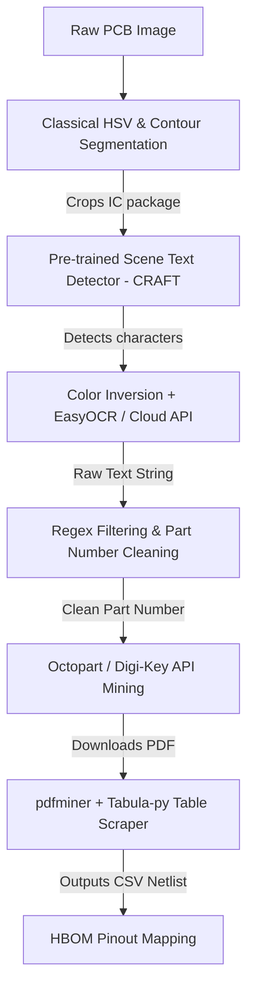

# Alternative Methodology: Golden-less & Dataset-free PCB Reverse Engineering
**Project**: Optical PCB Reverse Engineering (PCBRE)  
**Date**: July 8, 2026  
**Subject**: Alternative pathways for IC OCR, HBOM data mining, and trace analysis without custom datasets.

---

## 📌 Context
If you do not have local access to custom training datasets (like FPIC or FICS-PCB) to train deep learning models (like YOLOv8-OBB), you can achieve high-quality reverse engineering by leveraging **pre-trained models**, **classical computer vision heuristics**, and **open electronic components APIs**.

Below is a detailed architecture for a dataset-free pipeline.



---

## 🔍 1. Alternative Text Extraction (OCR) from ICs

Instead of training a custom YOLOv8-OBB model to find and crop text, you can combine classical segmentation with pre-trained OCR spotters:

### A. Classical HSV/Contour Bounding Boxes
*   **Method**: ICs are almost always black/dark grey rectangular or square plastic packages.
    1.  Convert the PCB image to the HSV color space.
    2.  Threshold for dark values (Value channel $< 50$) to create a binary mask of all dark components.
    3.  Apply morphological closing (`cv2.morphologyEx`) to merge lead gaps into solid blocks.
    4.  Find contours and filter by aspect ratio (typically $1.0$ for QFP/BGA, or $1.5$ to $4.0$ for SOIC/DIP packages) and minimum size.
*   **Result**: This isolates candidate IC crop regions without any training data.

### B. Pre-trained Scene Text Detectors (No Training Needed)
Instead of detecting the *IC package*, detect the *letters directly* using general-purpose models:
*   **CRAFT (Character Region Awareness for Text Detection)**: CRAFT is a highly robust pre-trained detector (built into EasyOCR) that localizes characters based on pixel affinity, regardless of font or rotation.
*   **PaddleOCR (DBNet)**: A lightweight, extremely fast text detector that works out-of-the-box on industrial text.

### C. Cloud OCR APIs (Commercial Alternative)
If offline compliance is not strict, commercial APIs have massive pre-trained dataset advantages:
*   **Google Cloud Vision / Microsoft Azure Read API**: As proved by the WOOT17 paper, these APIs successfully recognize highly degraded, rotated laser-etched IC markings out-of-the-box because they are trained on billions of street-view and document images.

---

## 🌐 2. Data Mining for HBOM Generation

Once you have a raw OCR string (e.g., `"STM32F051K8T6"` or `"MALAY 2204 STM32F0"`), you must clean it and mine the component details programmatically.

### Step A: Regex Naming Pattern Filtration
Discard batch codes, date codes, and country of origin labels. Match strings against standard manufacturer naming structures:
```python
import re

# Example: STMicroelectronics microcontroller regex
STM_REGEX = r"\b(STM32[F|L|G|H|WB|MP]\d{3}[A-Z0-9]{2,4})\b"

raw_ocr = "MALAY 2204 STM32F051C8T6"
match = re.search(STM_REGEX, raw_ocr)
if match:
    part_number = match.group(1)  # Outputs: STM32F051C8T6
```

### Step B: Component Data Mining via Public APIs
Query database endpoints with your cleaned part number to get manufacturer specs and datasheets:
1.  **Octopart API** (Recommended): 
    *   *Query*: Cleaned part number.
    *   *Response*: Returns manufacturer, part categories (e.g. "Microcontrollers"), packaging, mechanical dimensions, and direct URL links to the official datasheet PDF.
2.  **Mouser / Digi-Key Search APIs**:
    *   Allows automated querying to retrieve technical categories, pin counts, and package styles to construct the base **Hardware Bill of Materials (HBOM)**.

### Step C: Automated Pinout & Signal Table Extraction
Once the datasheet PDF is downloaded automatically:
1.  **Tabula-py (Python wrapper for Tabula)**:
    *   Extracts tables from PDF pages directly into Pandas DataFrames. Since datasheets contain standard tables mapping Pin Number to Pin Name (e.g. Pin 1 ➔ VDD), Tabula can extract this data programmatically.
2.  **pdfminer.six (XML structure parsing)**:
    *   Convert PDF pages to structured XML. Search for elements containing coordinates corresponding to terms like `"VDD"`, `"GND"`, `"VSS"`, `"TX"`, `"RX"`, `"MISO"`, `"MOSI"`.
3.  **Result**: Automatically populates a SQLite database mapping:
    $$\text{Component} \times \text{Pin Number} \rightarrow \text{Signal Net}$$

---

## ⚡ 3. Alternative Trace & Power Rail Mapping

If you cannot correlate nets via OBB, you can map power rails using image thresholding:

1.  **Green Channel Subtraction (Solder Mask Removal)**:
    *   On green PCBs, the green channel of the RGB image corresponds to the solder mask. Subtracting the green channel highlights the copper traces and vias underneath.
2.  **Adaptive Thresholding & Skeletonization**:
    *   Apply `cv2.adaptiveThreshold` to extract trace geometries.
    *   Apply skeletonization (`scikit-image`'s `skeletonize`) to get single-pixel-wide lines representing connectivity paths.
3.  **Connected Component Tracing**:
    *   Width analysis: Wide copper areas correspond to power planes/rails.
    *   Trace paths from known pins (determined from your database mapping in Step C) to identify which trace segments link together.
