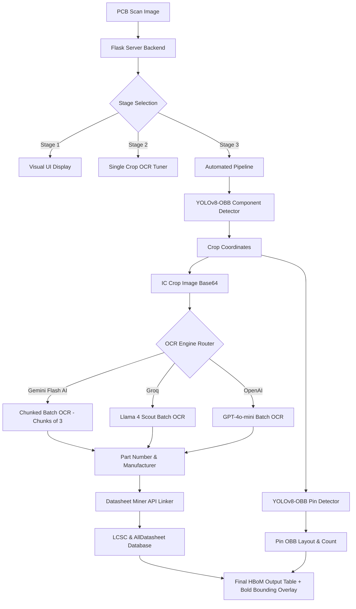

# Comprehensive System Report: Optical PCB Reverse Engineering (PCBRE)
**Project**: Optical PCB Reverse Engineering & Component Cataloging Pipeline  
**Author/Date**: July 15, 2026  
**Document Purpose**: Detailed analysis, software architecture, model evaluations, and implementation milestones.

---

## 📌 1. Project Context & Vision

PCBRE (PCB Reverse Engineering) is an intelligent computer-vision pipeline built to analyze physical PCBs from optical camera scans. The system automatically detects component boundaries, classifies active and passive components, extracts part numbers/markings using vision-based language models, crawls technical datasheets, and counts/maps individual IC pins.

### Key Workflows
* **Stage 1 (Upload & Preprocess)**: Image uploading, camera feed integration, and automatic bounding/warping.
* **Stage 2 (Manual Crop Tuner)**: Interactive tuner allowing hardware engineers to inspect individual IC packages and run manual OCR queries.
* **Stage 3 (Automated Pipeline)**: A one-click automated layout scanner utilizing custom YOLOv8 Oriented Bounding Box (OBB) models, vision OCR models, and database miners to construct a full Hardware Bill of Materials (HBoM).

---

## 🏗️ 2. System Architecture

---

## 🧠 3. YOLOv8-OBB Component Detection (Stage 3 Core)

Standard horizontal bounding boxes suffer on rotated circuit board layouts. By shifting to Oriented Bounding Boxes (OBB), we isolate component bodies without capturing adjacent traces or pads.

### Component Model Comparisons
We evaluated three scales of the YOLOv8-OBB architecture trained on the PCB component dataset:

| Target Class | Instances in Val | YOLOv8n (Nano) `imgsz=640` | YOLOv8s (Small) `imgsz=1024` | YOLOv8m (Medium) `imgsz=1024` | Delta (Medium vs. Nano) |
| :--- | :---: | :---: | :---: | :---: | :---: |
| **All Classes (mAP50)**| **979** | **0.445** | **0.569** | **0.749** | **+0.304 (+30.4%)** |
| **Inductors** | 18 | 0.879 | 0.933 | **0.970** | +0.091 |
| **ICs** | 45 | 0.772 | **0.850** | 0.732 | -0.040 |
| **Capacitors** | 508 | 0.553 | 0.721 | **0.785** | +0.232 |
| **Diodes** | 1 | 0.332 | 0.000 | **0.995** | +0.663 |
| **Resistors** | 401 | 0.127 | 0.414 | **0.581** | +0.454 |
| **Transistors** | 6 | 0.009 | **0.495** | 0.431 | +0.422 |

* **Key Takeaway**: Increasing the resolution to `imgsz=1024` prevented small object feature loss. Resistor mAP rose from **0.127 to 0.581 (+357% relative improvement)**. The application defaults to the Medium model (`model_yolov8m.pt`) for maximum localization quality.

---

## ⚡ 4. OCR Engine Integration & Scaling Workarounds

Once component crops are extracted, their surface markings must be parsed. We built a resilient multi-engine routing system:

### 1. Gemini Flash AI (Default & Recommended)
* **Problem**: The Gemini free tier has a strict 1 Million Tokens Per Minute (TPM) limit. Sending 15-30 raw high-res crops simultaneously exceeds this limit.
* **Solutions implemented**:
  * **Crop Downscaling Heuristic**: BGR crops are resized to a maximum of 250px inside `get_cropped_image()`. This reduces data payloads and token counts by 80% while retaining readability.
  * **Chunked Batch Queries**: Implemented `query_gemini_ocr_batch()`. Crops are grouped in chunks of 3. The backend executes queries sequentially with brief backoffs, successfully bypassing TPM constraints.
  * **Prompt Key-Error Fix**: Escaped standard curly braces (`{{` and `}}`) in prompt schemas to prevent Python string formatter errors.

### 2. Groq (Llama 4 Scout)
* Swapped out legacy Qwen-based vision models (which generated frequent 503 Service Unavailable errors) for the robust `meta-llama/llama-4-scout-17b-16e-instruct` model inside batch parsing configurations.

### 3. OpenAI GPT-4o-mini
* Structured fallback engine configured for automated batch calls. Payment processing limits for international cards in India prompted developers to design Gemini as the primary path.

### 4. Legacy/Offline Local OCR Cleanup
* Local OCR systems (EasyOCR and PaddleOCR) were previously integrated but introduced large CPU memory dependencies and OS runtime issues (such as PaddlePaddle 3.x's Windows PIR executor crash with Intel oneDNN: `ConvertPirAttribute2RuntimeAttribute`). 
* To streamline deployment, improve pipeline execution speed, and eliminate multi-gigabyte local virtual environment dependencies, **local OCR packages were completely removed from the pipeline**.

---

## 📍 5. YOLOv8-OBB Pin Detection Sub-System

To count pins on IC packages, we trained and integrated a local oriented pin pad detector.

### Kaggle Training Metrics (Tesla T4)
* **Model**: YOLOv8n-OBB (`ic_pin_yolo.pt`)
* **Epochs**: 100
* **Speed**: 2.0ms inference, 0.2ms preprocess
* **Results**:
  * **Precision (P)**: 90.0%
  * **Recall (R)**: 87.3%
  * **mAP@0.5**: 89.9%
  * **mAP@0.5:0.95**: 70.6%

### Software API Implementation
Two direct endpoints were implemented:
1. **Standalone API (`/api/detect_pins`)**: Resolves pin footprints and maps coordinates directly. It formats individual pin coordinates in standard YOLO OBB text syntax (`class_id x1 y1 x2 y2 x3 y3 x4 y4` normalized):
   * `yolo_obb_crop`: Normalized to individual chip crop coordinates.
   * `yolo_obb_main`: Mapped back and normalized relative to the full board resolution.
2. **Integrated HBoM Pipeline**: Combined layout, pin counting, and OCR details into a single JSON dataset.

### Bold Visualization & Scale Diagnostic
* **Bold Bounding Boxes**: Drawn with customized OpenCV styles—bolder boundary rectangles (thickness 4) and bright cyan pin footprints (thickness 2)—to maximize layout clarity in the user browser.
* **Scale Mismatch Resolution**: Because the OBB model was trained on global views where pins represent a fraction of the image canvas, feeding small individual IC crops (which are stretched during resizing) results in lower accuracy. **Recommendation**: Run the OBB model globally on the entire high-res PCB image rather than cropped chip segments.

---

## 📝 6. HBoM & Database Miner Integration

* **Datasheet Miner**: Leverages LCSC API queries (`jlcsearch`) to fetch categories, package info (e.g. `SOIC-8`, `TQFP-32`), descriptions, and AllDatasheet fallback links.
* **Footprint Matching**: Compares the datasheet-reported pin count to the computer-vision detected count (`cv_detected_pins` or `yolo_pin_count`) and flags consistency as `HIGH` (within 2 pins) or `LOW`.
* **CSV Export**: Fully aligned with the front-end layout, exporting the active HBoM table with columns for designators, part numbers, manufacturer categories, YOLO OBB pin counts, and confidence scores.
