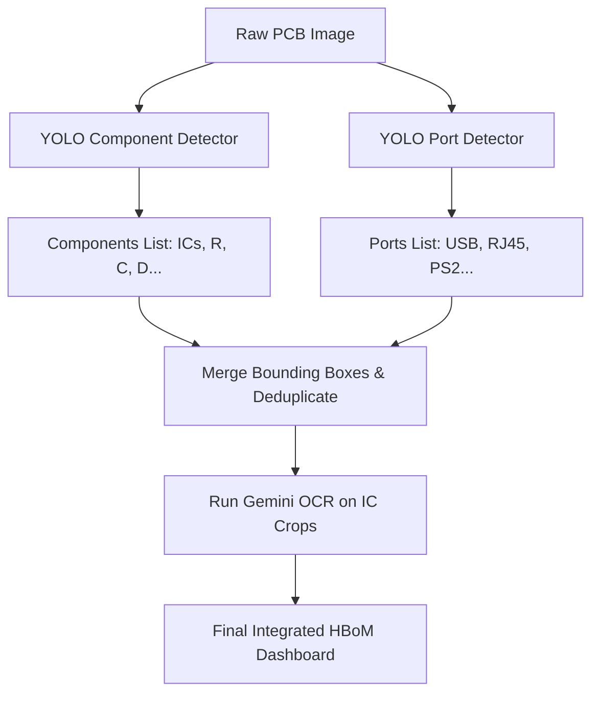

# Ports Dataset Integration & Multi-Model Pipeline Notes

This document provides a technical guide on how to integrate the [USB Ethernet PS2 Port Dataset](https://universe.roboflow.com/scmu/usb-ethernet-ps2-port/dataset/1) into the PCB Reverse Engineering (PCBRE) HBoM pipeline.

---

## 🏗️ Architectural Integration Options

To incorporate port detection alongside passive and active electronic components, you have two primary options:

### Option A: The Multi-Model Cascade Pipeline (Recommended)
Rather than trying to merge datasets (which is time-consuming and risks class imbalance), run two specialized YOLO models in series inside the Flask backend.



#### Why it's recommended:
1.  **Zero Annotation Overhead**: You don't have to merge the labels or re-annotate any images.
2.  **Dataset Autonomy**: You can train YOLOv8-OBB on the components dataset and standard YOLOv8 on the ports dataset separately.
3.  **Flexible Scaling**: Adding new object classes in the future (e.g., test points or PCB logos) only requires spinning up a new lightweight model.

---

### Option B: Unified Multi-Class Dataset Merging
Merge the datasets into a single training set.

1.  **Label Mapping**: Translate the labels of both datasets to a unified config (`data.yaml`):
    ```yaml
    names:
      0: ICs
      1: capacitors
      2: diodes
      3: fuses
      4: inductors
      5: resistors
      6: transducers
      7: transformers
      8: transistors
      9: usb-port
      10: ethernet-port
      11: ps2-port
    ```
2.  **Annotations Alignment**: Since the ports dataset is hosted on Roboflow, export it in **YOLOv8 Text format**, merge the directories, and update coordinate values.
3.  **Re-Training**: Train a new single `model_yolov8m_unified.pt` on the combined data.

---

## 📋 HBoM Designation Mappings for Ports

When port detection is live, they should be mapped to standard engineering designators in the final bill of materials:

| Roboflow Class Name | Designator Prefix | Example Designators | Component Type |
| :--- | :--- | :--- | :--- |
| `usb-port` | **`J`** (Connector/Jack) | `J1`, `J2` | USB Connector |
| `ethernet-port` | **`J`** (Connector/Jack) | `J3` | RJ45 Ethernet Connector |
| `ps2-port` | **`J`** (Connector/Jack) | `J4`, `J5` | Circular PS/2 Connector |

These can be displayed in the **Passive & Other Components** summary table as connector quantities, matching the exact layout we just built!
