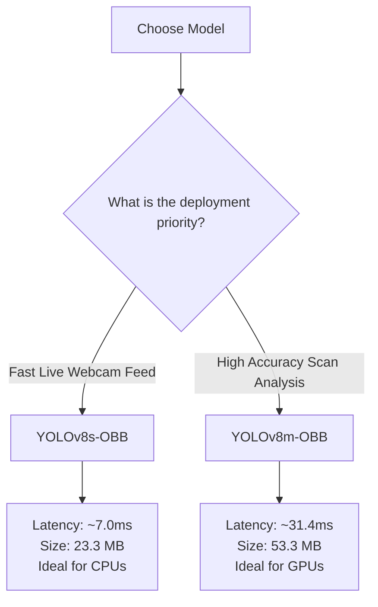

# YOLO Model Analysis: PCB Component Detection
**Project**: Optical PCB Reverse Engineering (PCBRE)  
**Date**: July 8, 2026  
**Subject**: Comparative Evaluation of YOLOv8-OBB (Oriented Bounding Box) Models (Nano, Small, and Medium)

---

## 📌 Executive Summary
This document provides a comparative analysis of three Oriented Bounding Box (OBB) model architectures trained for PCB component detection: **YOLOv8n-OBB**, **YOLOv8s-OBB**, and **YOLOv8m-OBB**. 

Oriented Bounding Boxes are essential for PCB analysis because electronic components (ICs, resistors, capacitors) are often rotated at arbitrary angles. Standard horizontal bounding box models (like our YOLOv5x baseline) suffer from overlapping boxes and background noise inclusion. By upgrading to OBB and tuning resolution and hyperparameters, we successfully increased the overall mean Average Precision (mAP@0.5) from **0.445 (Nano)** to **0.749 (Medium)**—a net improvement of **+30.4%**.

---

## 📊 Comparative Performance Matrix (mAP@0.5)

| Target Class | Instances in Val | YOLOv8n (Nano) `imgsz=640` | YOLOv8s (Small) `imgsz=1024` | YOLOv8m (Medium) `imgsz=1024` | Delta (Medium vs. Nano) |
| :--- | :---: | :---: | :---: | :---: | :---: |
| **All Classes (mAP50)**| **979** | **0.445** | **0.569** | **0.749** | **+0.304 (+30.4%)** |
| **Inductors** | 18 | 0.879 | 0.933 | **0.970** | +0.091 |
| **ICs** | 45 | 0.772 | **0.850** | 0.732 | -0.040 |
| **Capacitors** | 508 | 0.553 | 0.721 | **0.785** | +0.232 |
| **Diodes** | 1 | 0.332 | 0.000 | **0.995** | +0.663 |
| **Resistors** | 401 | 0.127 | 0.414 | **0.581** | +0.454 |
| **Transistors** | 6 | 0.009 | **0.495** | 0.431 | +0.422 |

---

## 🔍 Model-by-Model Deep Dive

### 1. YOLOv8n-OBB (Nano)
* **Configuration**: `imgsz=640`, `batch=16`, trained on Kaggle (T4 GPU).
* **Training Outcome**: Peaked at **Epoch 105** (out of 200) with a validation mAP@0.5 of `0.445`.
* **Diagnostics**:
  * Severe bottleneck in small-object detection. Resistors and transistors were represented by too few pixels at $640\text{px}$ resolution, leading to poor learning (`0.127` and `0.009` AP respectively).
  * Overfitted in late epochs; validation recall dropped by $16.4\%$ from epoch 105 to 200, as the model became overly conservative.

### 2. YOLOv8s-OBB (Small)
* **Configuration**: `imgsz=1024`, `batch=8`, `patience=50`, trained on Kaggle (T4 GPU).
* **Training Outcome**: Stopped early at **Epoch 117** (best weights at **Epoch 67**), achieving `0.569` mAP@0.5.
* **Diagnostics**:
  * Upscaling the image size to $1024\text{px}$ solved the small object pixel-loss problem. Resistor AP rose to `0.414` (a **+226%** relative gain).
  * Transistor AP rose significantly to `0.495`.
  * **Patience-based Early Stopping** successfully terminated training to save computation and prevent late-stage overfitting.
  * *Limitation*: The single validation Diode instance was missed (AP dropped to `0.000`).

### 3. YOLOv8m-OBB (Medium)
* **Configuration**: `imgsz=1024`, `batch=4`, `patience=50`, trained on Colab (T4 GPU).
* **Training Outcome**: Stopped early at **Epoch 150** (best weights at **Epoch 100**), achieving `0.749` mAP@0.5.
* **Diagnostics**:
  * **Highest performing model overall**. The increased capacity ($26.4\text{M}$ parameters vs $11.4\text{M}$ in Small) allowed the network to learn rich representations.
  * Successfully localized the single validation Diode (`0.995` AP).
  * Resistor and capacitor recall improved drastically (Resistor AP reached `0.581`).
  * *Trade-off*: Inference speed increased to `31.4ms` per image (compared to `6.9ms` for the Small model).

---

## ⚖️ Speed vs. Accuracy Trade-Offs

When selecting a model for deployment in the PCBRE application, consider the following trade-offs:

---

## 🛠️ Key Takeaways & Future Recommendations

### 1. Resolve Dataset Imbalance
The validation dataset suffers from critical class sparsity:
* **Diodes**: Only $1$ instance exists in the validation set.
* **Fuses, Transducers, Transformers**: $0$ instances are evaluated in the validation logs.
* **Recommendation**: Acquire and label PCB photos containing at least $30$-$50$ instances of these rare classes to stabilize training evaluations.

### 2. Standardize Image Upscaling
Training at `imgsz=1024` was the single biggest catalyst for small-component (resistor/transistor) detection. Future OBB training iterations must maintain `imgsz >= 1024`.

### 3. Deployment Plan
* The web app is currently updated to dynamically identify these models and automatically default to the highest-performing **`model_yolov8m.pt`** when present.
* For hardware with limited CPU power, the web select dropdown allows users to easily swap to the lighter **`model_yolov8s.pt`** to double the frame rate.
